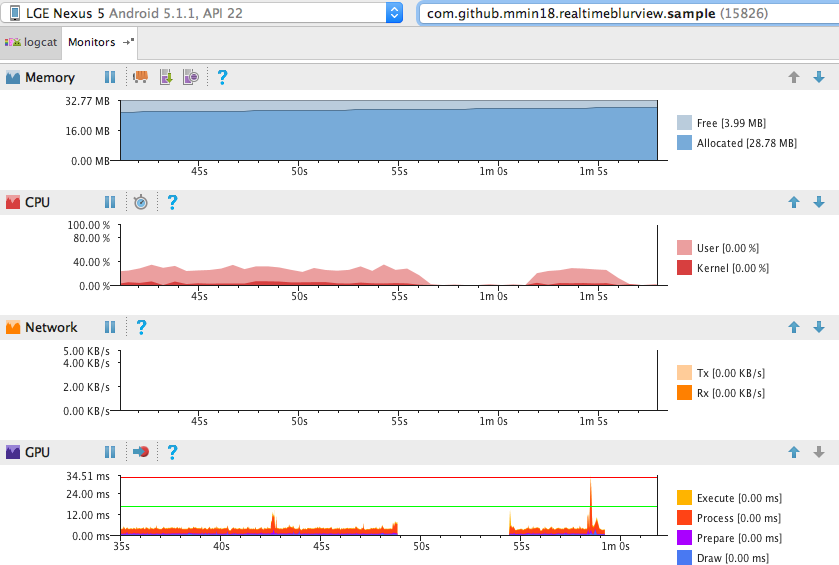

# RealtimeBlurView

It's just a realtime blurring overlay like iOS UIVisualEffectView.


Just put the view in the layout xml, no Java code is required.

	// Views to be blurred
	<ImageView ../>
	
	<com.github.mmin18.widget.RealtimeBlurView
		android:layout_width="match_parent"
		android:layout_height="match_parent"
		app:realtimeBlurRadius="20dp"
		app:realtimeOverlayColor="#8000" />
	
	// Views above blurring overlay
	<Button ../>

Try the sample apk: [blurring.apk](imgs/blurring.apk)

## Adding to project

Add dependencies in your `build.gradle`:

```groovy
	dependencies {
	    compile 'com.github.mmin18:realtimeblurview:1.0.4'
	}
	android {
		buildToolsVersion '23.0.3'                 // Use 23.0.3 or higher
		defaultConfig {
			minSdkVersion 15
			renderscriptTargetApi 19
			renderscriptSupportModeEnabled true    // Enable RS support
		}
	}
```

# Performance

RealtimeBlurView use RenderScript to blur the bitmap, just like [500px-android-blur](https://github.com/500px/500px-android-blur).

Everytime your window draw, it will render a blurred bitmap, so there is a performance cost. Set downsampleFactor>=4 will significantly reduce the render cost. However, if you just want to blur a static view, 500px-android-blur is good enough.

I've run the sample on some old phones like Samsung Galaxy S2, Samsung Galaxy S3, it runs at full FPS. Here is a performance chart while scrolling the list on Nexus 5.



# Changelog

### 1.0.4 (2016-9-28)

Support custom shape (by override drawBlurredBitmap()), support view in ContextThemeWrapper.
